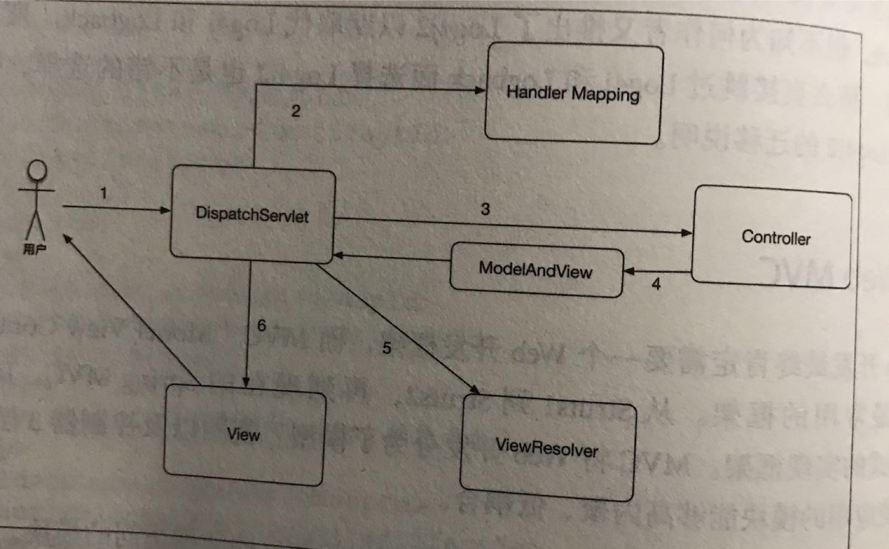

#   开发框架

-   IOC框架：依赖注入/控制反转，将依赖从代码层面转移到容器配置层面
-   ORM框架：对象关系映射，即数据库的表和Java对象之间转换
-   Log框架：日志框架，记录应用运行、异常日志
-   Web框架：一般是指Model-View-Controller的分层Web开发框架，将业务代码做了逻辑分层，各司其职，灵活配置和扩展
-   安全框架：处理权限、限制等请求
-   AOP框架：日志管理、数据库事务处理，横向逻辑抽离
-   缓存框架：提高读取数据的效率

##  依赖注入
##  对象关系映射
##  日志
##  Web MVC

流程图

-   用户发起请求到`DispatcherServlet`(在web.xml中配置，是Spring MVC的前置控制器)
-   从`Handler Mapping`中匹配此次请求信息的Handle，匹配的条件包括：请求路径、请求方法、header信息等，常用：
    -   SimpleUrlHandlerMapping：简单的映射一个URL到一个 Handler
    -   RequestMappingHandlerMapping：扫描 RequestMapping 注解，根据相关配置，绑定URL到一个Handler
-   获取对应的 `Handler`(Controller，控制器)后，调用相应的方法。这里牵扯一个关键组件 `HandlerAdapter`，是 Controller 的适配器，Spring MVC最终是通过 HandlerAdapter 来调用实际的 Controller方法的，常用：
    -   SimpleControllerHandlerAdapter：处理实现了 Controller 接口的Controller
    -   RequestMappingHandlerAdapter：处理类型为 HandlerMethod 的 Handler，这里使用 RequestMapping注解的 Controller 的方法就是一种 HandlerMethod
-   Handler执行完毕，返回相应的 ModelAndView
-   使用配置好的 ViewResolver 来解析返回结果，常用：
    -   UrlBasedViewResolver：通过配置文件，根据URL把一个视图名交给一个 View 来处理
    -   InternalResourceViewResolver：根据配置好的资源路径，解析为jsp视图，支持jstl
    -   FreeMarkerViewResolver：FreeMarker的视图解析器
-   生成视图返回给用户，常用：
    -   MappingJackson2JsonView：使用 mappingJackson 输出JSON数据的视图，数据来源于 ModelMap
    -   FreeMarkerView：使用FreeMarker模板引擎的视图
    -   JstlView：输出jsp页面，可以使用jsp标准标签库
-   相关组件
    -   HandlerInterceptor：请求路径上的拦截器，需要自己实现这个接口以拦截请求，做一些对Handler的前置或后置处理工作
    -   HandlerExceptionResolver：异常处理器，可以实现自己的处理器在全局层面拦截 Handler 抛出的Exception，再做进一步的处理，常用：
        -   SimpleMappingExceptionResolver：将不同的异常映射到不同的jsp页面
        -   ExceptionHandlerExceptionResolver：解析使用了 @ExceptionHandler 注解的方法来处理异常
        -   ResponseStatusExceptionResolver：处理 @ResponseStatus 注解的 Exception
        -   DefaultHandlerExceptionResolver：默认的处理器，包括不支持 method、不支持 mediaType等

