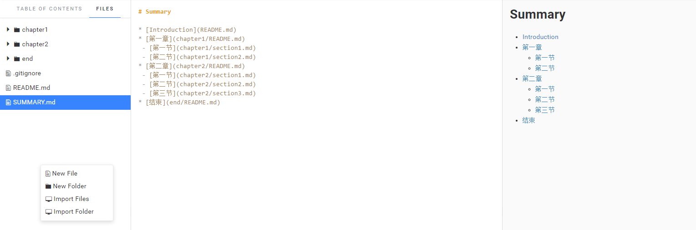
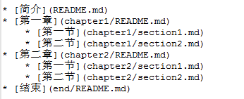
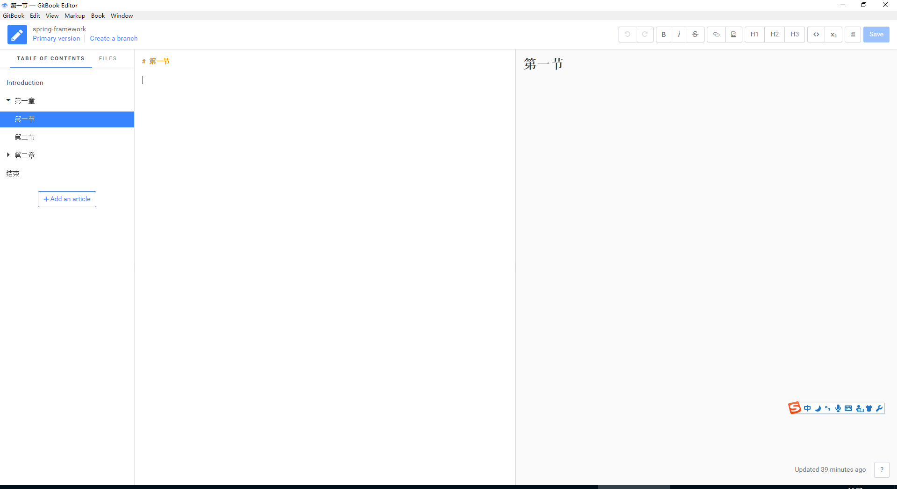

### Gitbook安装
Gitbook是一个用来编写书籍的软件,左边是目录,右边是内容,可以一一对应,eg:[Redux中文文档](https://leecade.gitbooks.io/redux-in-chinese/content/).     
> 需要安装的软件:
1.  Node  
  - 建议选择[淘宝NPM镜像](https://npm.taobao.org/)  
  - 验证  
    ```
    node -v
    ```
2.  Gitbook   
  - NMP安装Gitbook  
    ```
    npm install gitbook -g
    ```
  - 安装gitbook CLI   
    ```
    npm install -g gitbook-cli
    ```
  - 检验下是否安装成功
    ```
    gitbook -V  
    ```
3.   GitBookEditor  
  - [下载](https://www.gitbook.com/editor)  
4.  注册并创建一部书籍   
5.  打开GitBookEditor
  - 登录..
  - 看到刚才在网站上创建的书籍
6.  找个安置目录:     
  - 比如  ../github/gitbook,这个作为Gitbook根目录  
  - 'GitBook Editor' -> 'Change Library Path'.    

> 开始编写:
1.  预备设置目录  
  - 
2.  编辑SUMMARY.md:
  - 
  - 然后依据输入的右键创建目录和文件..
  - SUMMARY.md目录引用文件
3.  实际效果    
  -    
  - 文章编写可以使用 Markdown     


> 附录:
  - 参考链接  
  http://blog.csdn.net/xiaocainiaoshangxiao/article/details/46882921  
  https://segmentfault.com/a/1190000005859901
