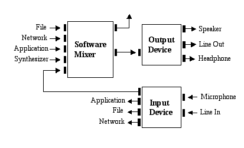
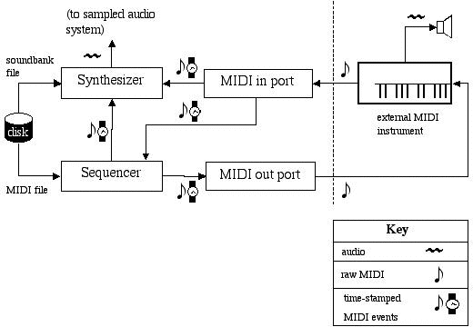

#   声音
Java Sound API是用于影响和控制声音媒体输入和输出的低级API，包括音频和乐器数字接口（MIDI）数据。Java Sound API可以在促进可扩展性和灵活性的框架中明确控制声音输入和输出通常所需的功能。

Java Sound API满足了广泛的应用程序开发人员的需求。潜在的应用领域包括：
-   通信框架，如会议和电话
-   最终用户内容交付系统，如媒体播放器和使用流媒体内容的音乐
-   交互式应用程序，如使用动态内容的游戏和网站
-   内容创建和编辑
-   工具，工具包和实用程序

Java Sound API在Java平台上提供最低级别的声音支持。它为应用程序提供了对声音操作的大量控制，并且是可扩展的。例如，Java Sound API提供安装，访问和操作系统资源的机制，如音频混合器，MIDI合成器，其他音频或MIDI设备，文件读取器和编写器以及声音格式转换器。Java Sound API不包括复杂的声音编辑器或图形工具，但它提供了可以构建这些程序的功能。它强调超出最终用户通常预期的低级别控制。

Java Sound API包含对数字音频和MIDI数据的支持。这两个主要功能模块分别提供在不同的软件包中：
-   javax.sound.sampled - 该软件包为数字（采样）音频的采集，混合和回放指定接口。
-   javax.sound.midi - 该软件包为MIDI合成，排序和事件传输提供接口。

另外两个软件包允许服务提供者（而不是应用程序开发者）创建自定义软件组件，以扩展Java Sound API实现的功能：
-   javax.sound.sampled.spi
-   javax.sound.midi.spi

本页面介绍采样音频系统，MIDI系统和SPI包。然后，本教程稍后会详细讨论每个包。

-----
`注意`： 

还有其他的Java平台API也有声音相关的元素。在 Java媒体框架API（JMF）是目前作为Java平台的标准扩展提供的更高级别的API。JMF指定了用于捕获和回放基于时间的媒体的统一体系结构，消息传递协议和编程接口。JMF为基本的媒体播放器应用程序提供了一个更简单的解决方案，它可以实现不同媒体类型（如音频和视频）之间的同步。另一方面，专注于声音的程序可以受益于Java Sound API，特别是如果它们需要更高级的功能，例如仔细控制缓冲音频播放或直接操作MIDI合成器的功能。其他具有良好声音的Java API包括用于电话和语音的Java 3D和API。任何这些API的实现都可能在内部使用Java Sound API的实现，但不需要这样做。

-----

##  什么是采样音频？

该 javax.sound.sampled包处理数字音频数据，Java Sound API将其称为采样音频。样本是信号的连续快照。在音频的情况下，信号是声波。麦克风将声音信号转换成相应的模拟电信号，并且模数转换器将该模拟信号转换为采样的数字形式。下图显示了录音中的一个短暂时刻。

采样声波

此图形绘制纵轴上的声压（振幅）和横轴上的时间。以特定速率周期性地测量模拟声波的幅度，从而导致构成数字音频信号的离散样本（图中的红色数据点）。中心水平线表示零幅度; 线上的点是正值样本，下面的点是负值。模拟信号的数字逼近的精度取决于其时间分辨率（采样率）及其量化，或幅度分辨率（用于表示每个采样的位数）。作为参考点，记录在光盘上的音频采样率为每秒44,100次，每个采样的采样率为16位。

术语“采样音频”在这里稍微松散地使用。声波可以以离散时间间隔进行采样，同时保持模拟形式。但是，对于Java Sound API而言，“采样音频”相当于“数字音频”。

通常情况下，计算机上的采样音频来自录音，但声音可能是合成生成的（例如，创建按键式电话的声音）。术语“采样音频”是指数据的类型，而不是其来源。

Java Sound API不承担特定的音频硬件配置; 它旨在允许将不同种类的音频组件安装在系统中并由API访问。Java Sound API支持常用功能，例如声卡的输入和输出（例如，用于录制和播放声音文件）以及混合多个音频流。以下是典型音频体系结构的一个示例：

典型的音频架构

在这个例子中，诸如声卡之类的设备具有各种输入和输出端口，并且在软件中提供混合。混音器可能会接收从文件中读取的数据，从网络流式传输，由应用程序随时产生或由MIDI合成器产生的数据。该混音器将其所有音频输入组合成一个单一的数据流，并将其发送到输出设备进行渲染。

##  什么是MIDI？

该 javax.sound.midi中的包中包含运输和测序MIDI事件，并从这些事件中合成声音API。

而采样音频是声音本身的直接表示，即MIDI数据可以被认为是创造声音，尤其是音乐声音的配方。与音频数据不同，MIDI数据不直接描述声音。相反，它描述了影响MIDI设备或仪器（如合成器）执行的声音（或动作）的事件。MIDI数据类似于图形用户界面的键盘和鼠标事件。在MIDI的情况下，事件可以被认为是对音乐键盘的动作，以及该乐器上的各种踏板，滑块，开关和旋钮的动作。这些事件实际上不一定是来自硬件乐器; 它们可以用软件模拟，并且可以存储在MIDI文件中。可以创建，编辑和执行这些文件的程序称为音序器。许多计算机声卡包括MIDI控制的音乐合成器芯片，音序器可以发送它们的MIDI事件。合成器也可以完全用软件实现。合成器解释它们接收到的MIDI事件并产生音频输出。通常，从MIDI数据合成的声音是音乐声音（例如，与语音相反）。MIDI合成器也能够产生各种音效。

某些声卡包括可连接外部MIDI硬件设备（如键盘合成器或其他乐器）的MIDI输入和输出端口。从MIDI输入端口，应用程序可以接收外部装有MIDI的乐器产生的事件。该程序可以使用计算机的内部合成器播放音乐演奏，将其作为MIDI文件保存到磁盘，或者将其渲染为音乐符号。程序可能使用MIDI输出端口播放外部乐器，或者控制其他外部设备，如录音设备。

下图说明了基于Java Sound API的可能的MIDI配置中主要组件之间的功能关系。（与音频一样，Java Sound API允许安装和互连各种MIDI软件设备，这里显示的系统只是一种可能的情况。）组件之间的数据流由箭头表示。数据可以是标准文件格式，或者（如图中右下角的键所示），它可以是音频，原始MIDI字节或时间标记的MIDI信息。

可能的MIDI配置

在这个例子中，应用程序通过将存储为标准MIDI文件的乐谱加载到磁盘（图的左侧）来准备音乐演奏。标准MIDI文件包含音轨，每个音轨都是带时间标记的MIDI事件列表。大部分事件代表音符（音调和节奏）。该MIDI文件被读取，然后由软件定序器“执行”。音序器通过将MIDI消息发送到其他设备（如内部或外部合成器）来执行其音乐。合成器本身可以读取包含用于模拟某些乐器的声音的指令的音库文件。如果不是，合成器将使用任何已经加载到乐器中的乐器声音播放存储在MIDI文件中的音符。

如图所示，在通过MIDI输出端口将MIDI事件发送到外部MIDI乐器之前，必须将MIDI事件转换为原始（不带时间标记的）MIDI。类似地，从外部MIDI源（图中的键盘乐器）进入计算机的原始MIDI数据被转换为可以控制合成器的时间标记的MIDI信息，或者音序器可以存储以供以后使用。

##  服务提供者接口

The javax.sound.sampled.spi和 javax.sound.midi.spipackages包含API，可让软件开发人员创建新的音频或MIDI资源，这些资源可以单独提供给用户并“插入”到现有的Java Sound API实现中。以下是可以用这种方式添加的服务（资源）的一些示例：
-   一个音频混音器
-   一个MIDI合成器
-   可以读取或写入新类型的音频或MIDI文件的文件解析器
-   在不同的声音数据格式之间转换的转换器

在某些情况下，服务是硬件设备（如声卡）功能的软件接口，服务提供商可能与硬件供应商相同。在其他情况下，服务纯粹以软件存在。例如，合成器或混音器可以是声卡上芯片的接口，或者可以在没有任何硬件支持的情况下实现。

Java Sound API的实现包含一组基本的服务，但服务提供者接口（SPI）包允许第三方创建新的服务。这些第三方服务以与内置服务相同的方式集成到系统中。在 AudioSystem类和 MidiSystem类行为作为让应用程序显式或隐式访问服务协调员。通常服务的存在对于使用它的应用程序是完全透明的。服务提供者机制可以使基于Java Sound API的应用程序用户受益，因为可以将新的声音特性添加到程序中，而不需要新的JDK或运行时环境版本，并且在很多情况下甚至不需要新的应用程序本身的发布。

##  目录

-   [采样软件包概述](section150100.md)
-   [访问音频系统资源](section150200.md)
-   [播放音频](section150300.md)
-   [捕获音频](section150400.md)
-   [使用控件处理音频](section150500.md)
-   [使用文件和格式转换器](section150600.md)
-   [MIDI包概述](section150700.md)
-   [访问MIDI系统资源](section150800.md)
-   [传送和接收MIDI讯息](section150900.md)
-   [排序器简介](section151000.md)
-   [使用Sequencer方法](section151100.md)
-   [使用高级音序器功能](section151200.md)
-   [合成声音](section151300.md)
-   [服务提供者接口简介](section151400.md)
-   [提供采样音频服务](section151500.md)
-   [提供MIDI服务](section151600.md)
