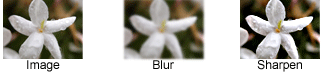

#   2D图形
本小节将向您介绍Java 2D™API，并向您展示如何在Java程序中显示和打印2D图形。该线索适用于想要丰富自己对Java 2D API知识的开发人员，以及计算机图形学初学者。几乎每个部分都包含相关示例来说明具体功能。Java 2D API使您可以轻松执行以下任务：
-   绘制线条，矩形和任何其他几何形状。
-   用纯色或渐变和纹理填充这些形状。
-   用选项绘制文本，以精确控制字体和渲染过程。
-   绘制图像，可选应用过滤操作。
-   在上述任何渲染操作期间应用合成和变换等操作。
-   本章还解释了一些不太熟悉的概念，如合成。

使用2D图形API来显示复杂的图表

使用图像过滤操作
本章介绍绘制屏幕和屏幕外图像的概念，以及表面和打印机设备。此线索涵盖了Java 2D API的最常见用途，并简要介绍了一些更高级的功能。

-   [Java 2D图形API概述](section160100.md)介绍了关键的Java 2D概念并描述了Java 2D渲染模型。这节课比其他课程更具概念性，它使您能够深入了解基本概念和课程描述。
-   [Graphics入门](section160200.md)使用开发的示例向您展示如何获取Graphics对象并将其用于常见的图形渲染任务。
-   [使用几何体](section160300.md)教你如何使用API​​来绘制图形基元和任意形状，以及如何应用奇特的笔触和填充样式。
-   [使用Text API](section160400.md)向您展示如何有效地使用文本API，包括如何创建Font具有所需属性的对象，测量文本以及确定系统中可用字体的名称。
-   [使用图像](section160500.md)解释了如何创建BufferedImage对象，执行图像过滤操作以及在图像上绘图。
-   [打印](section160600.md)将教您如何将2D图形渲染到打印机，打印复杂文档以及使用打印服务。
-   [Java 2D](section160700.md)中的高级主题解释了如何执行转换，剪切绘图区域，合成重叠图形，指定渲染首选项以及控制渲染质量。

##  目录

-   [Java 2D API概念概述](section160100.md)
    -   [坐标](section160101.md)
    -   [Java 2D渲染](section160102.md)
    -   [几何图元](section160103.md)
    -   [文本](section160104.md)
    -   [图片](section160105.md)
    -   [印花](section160106.md)
-   [图形入门](section160200.md)
-   [使用几何](section160300.md)
    -   [绘制几何图元](section160301.md)
    -   [绘制任意形状](section160302.md)
    -   [抚摸和填充图形原语](section160303.md)
-   [使用文本API](section160400.md)
    -   [字体概念](section160401.md)
    -   [文本布局概念](section160402.md)
    -   [物理和逻辑字体](section160403.md)
    -   [测量文本](section160404.md)
    -   [高级文本显示](section160405.md)
        -   [使用渲染提示显示反锯齿文本](section160405/0100.md)
        -   [使用文本属性来设置文本样式](section160405/0200.md)
        -   [绘制多行文字](section160405/0300.md)
        -   [使用双向文本](section160405/0400.md)
-   [使用图像](section160500.md)
    -   [读取/加载图像](section160501.md)
    -   [绘制图像](section160502.md)
    -   [创建并绘制到图像](section160503.md)
    -   [写入/保存图像](section160504.md)
-   [印花](section160600.md)
    -   [基本打印程序](section160601.md)
    -   [使用打印设置对话框](section160602.md)
    -   [打印多页文档](section160603.md)
    -   [使用打印服务和属性](section160604.md)
    -   [打印用户界面的内容](section160605.md)
    -   [在Swing组件中打印支持](section160606.md)
-   [Java2D中的高级主题](section160700.md)
    -   [转换形状，文本和图像](section160701.md)
    -   [剪切绘图区域](section160702.md)
    -   [合成图形](section160703.md)
    -   [控制渲染质量](section160704.md)
    -   [从几何图元构造复杂形状](section160705.md)
    -   [支持用户交互](section160706.md)

