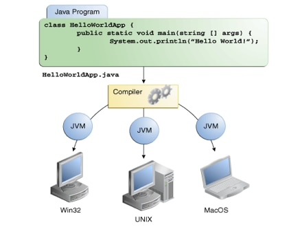
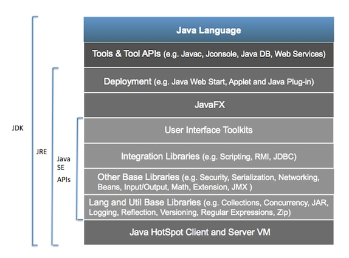

# Java

Java 是一种高级语言和独立于硬件的软件平台。它运行在全世界超过 5000 万台个人电脑和数十亿台设备上

Java 平台的两个主要组成部分是 Java 应用程序编程接口 (API) 和 Java 虚拟机 (JVM)。API 是 Java 命令行的库，JVM 将 Java 代码解释成机器语言。

同一个应用程序可以在多个平台上运行

---

##  Java Platform, Standard Edition (Java SE)

Java SE 让用户可以在桌面和服务器上以及嵌入式环境中开发和部署 Java 应用程序。Java SE 包含 Java 编程语言库的核心。

ava SE 由 Java Development Kit (JDK)、Java Runtime Environment (JRE) 和 Java SE 应用程序编程接口 (API) 组成。JDK 包含 JRE 以及开发小程序和应用程序所必需的编译器和调试器。JRE 提供运行用 Java 小程序和应用程序所需的库、Java 虚拟机 (JVM) 和组件。（参见下图）

`Java SE 概念图`

### [Java SE8](SE/README.md)
### [教程](SE/tutorial/README.md)
### [语言环境](langenv/README.md)

----

##  Java Platform, Enterprise Edition (Java EE)

Java Platform, Enterprise Edition (Java EE) 是构建 Web 应用程序和企业应用程序的行业标准。利用新的轻量级 Java EE 6 Web Profile 创建下一代 Web 应用程序，利用 Java EE 6 平台的强大功能构建企业应用程序。Glassfish 是开源的 Java EE 服务器，可免费下载。Java EE 是社区驱动的企业软件标准。Java EE 是利用 Java Community Process 开发的，业界专家、商业组织和开源组织、Java 用户组以及数不清的个人为此做出了巨大贡献。每个版本都集成了符合业界需求的新特性，提高了应用可移植性，提高了开发人员的工作效率

### [Java EE7](EE/README.md)
###  [教程](EE/tutorial/README.md)
---

----

##  Java技术术语

JavaServer Pages，JPA，EJB，JAX-RS和Servlet - 对于新手和有经验的开发人员来说，Java技术名称和首字母缩略词可能会让人困惑。本文以易于扫描的方式定义了最常见的Java术语。  

|Java术语|定义|
|----|----|
|Java Persistence API|Java持久性API为对象关系映射提供POJO持久性模型|
|Enterprise JavaBeans (EJB)|EJB是一种服务器端规范，以标准方式处理业务逻辑，如持久性，事务完整性和安全性|
|JAX-RS|JAX-RS是用于RESTful服务的Java API。 它支持使用具象状态传输（REST）体系结构创建Web服务。 JAX-RS提供注释来帮助将资源类（POJO）映射为Web资源|
|Abstract Window Toolkit (AWT)|AWT是一组用于创建组件的类，例如applet和独立应用程序的按钮，菜单和滚动条。|
|Applet|一个applet是一个在web浏览器中运行的Java程序。 小程序使用图形用户界面，可能有文本，图像，按钮，滚动条和声音。|
|HotSpot VM|在通常用于客户端应用程序的平台上，JDK附带一个称为Java HotSpot Client VM（客户端VM）的VM实现。 客户端虚拟机进行了调整，以减少启动时间和内存占用量。 可以在启动应用程序时使用-client命令行选项来调用它。 JDK还附带一个称为Java HotSpot Server VM（服务器VM）的Java虚拟机的实现。 服务器虚拟机专为最大程序执行速度而设计。 可以在启动应用程序时使用-server命令行选项来调用它|
|Java Advanced Imaging (JAI) API|JAI API提供了一组面向对象的接口，支持简单的高级编程模型，使您可以轻松地操作图像，并且JAI扩展了Java平台的范围，从而可以将复杂的高性能图像处理功能并入 Java小程序和应用程序。|
|Java API|Java应用程序编程接口（API）是预先编写的代码，组织成类似主题的包。 例如，Applet和AWT包中包含用于创建字体，菜单和按钮的类。|
|Java API for XML Processing (JAXP)|JAXP使应用程序能够分析验证和转换XML文档。 最新版本是JAXP 1.3，它是J2SE 5.0的一部分。 还可以使用适用于早期版本的J2SE的实现。|
|Java Authentication and Authorization Services (JAAS)|JAAS是一组API，使服务能够对用户进行身份验证和强制访问控制。 它实现了标准可插入认证模块（PAM）框架的Java技术版本，并支持基于用户的授权|
|Java Communications API|Java Communications API可用于编写语音邮件，传真和智能卡等技术的平台无关通信应用程序。|
|Java Cryptography Extension (JCE)|JCE是一套为加密，密钥生成和密钥协议以及消息认证码（MAC）算法提供框架和实现的软件包。 支持加密包括对称，非对称，块和流密码。 该软件还支持安全流和密封对象。|
|Java Foundation Classes (JFC)|JFC是一组GUI组件和其他服务，可简化桌面和Internet / Intranet应用程序的开发和部署。 JFC是包含AWT的超集。 JFC通过添加许多组件和服务来扩展AWT。 JFC由Swing，Java 2D，AWT，辅助功能和拖放式API组成。|
|Java Media FrameWork (JMF)|JMF支持将音频，视频和其他基于时间的媒体添加到基于Java技术的应用程序和小程序中。 该可选软件包可以捕获，回放，流式处理和转码多种媒体格式，为多媒体开发人员提供了一个强大的工具包来开发可扩展的跨平台技术，从而扩展了Java平台。|
|Java Native Interface (JNI)|JNI是作为JDK一部分的Java的本机编程接口。 JNI允许Java代码与其他语言（如C，C ++和汇编语言）编写的应用程序和库一起运行。 仅适用于高级程序员。|
|Java 3D API|Java 3D API提供了一组面向对象的接口，支持一个简单的高级编程模型，您可以使用它来构建，渲染和控制3D对象和视觉环境的行为。 借助Java 3D API，您可以将基于Java技术的高质量，可扩展，独立于平台的3D图形集成到应用程序和小程序中。|
|Java Virtual Machine (JVM)|JVM执行Java编译器生成的指令。 此运行时环境（即JVM）嵌入在各种产品中，例如Web浏览器，服务器和操作系统。|
|Java Web Start|使用Java Web Start技术，独立的Java软件应用程序可以通过网络单击进行部署。 Java Web Start确保将部署最新版本的应用程序，以及Java Runtime Environment（JRE）的正确版本。|
|JavaBeans|JavaBeans架构提供了一种设计可重用软件组件的方法，可以在构建器工具中对其进行可视化操作。 JavaBeans可以像按钮一样简单，或者像访问数据库的工具那样更复杂。|
|Javadoc Tool|Javadoc工具用于从源代码中的doc注释生成HTML格式的API文档。 它只能作为JDK下载的一部分下载。|
|JavaHelp System|JavaHelp软件是一个功能齐全，独立于平台的可扩展帮助系统，使您能够将在线帮助合并到小应用程序，组件，应用程序，操作系统和设备中。 作者还可以使用JavaHelp软件为Web和公司Intranet提供在线文档。|
|JavaServer Faces Technology|JavaServer Faces技术简化了为JavaServer应用程序构建用户界面。 各种技能水平的开发人员可以通过在页面中组装可重用的UI组件，将这些组件连接到应用程序数据源以及将客户端生成的事件连接到服务器端事件处理程序来快速构建Web应用程序。|
|JavaServer Pages (JSP)|通过使用HTML嵌入scriptlet（Java编程语言代码）来创建带有JSP页面的动态网页。 JSP页面处理表单，执行计算或执行任何可以用Java编程语言编写的任何内容。|
|JDBC|JDBC是用于执行SQL语句的Java API。 通过使用JDBC API，您可以访问几乎所有的数据源，从关系数据库到电子表格到平面文件。|
|JDK|JDK是一套Java开发工具的简称，它由API类，Java编译器和Java虚拟机解释器组成，无论哪个版本。 JDK用于编译Java应用程序和applet。|
|JINI|JINI网络技术使任何服务（从企业系统到厨房电器）都能够顺畅，简单地进行网络连接。 JINI架构允许每个服务（设备或软件）告诉他人如何与之通话，而无需任何管理员设置|
|RMI|RMI允许Java应用程序通过网络进行通信。 通信应用程序可以在地球两侧的不同计算机上运行。 这种更高级的基于方法的网络通信方法允许像本地对象一样容易地访问远程对象。|
|Servlets|servlet是对服务器的扩展，可以增强服务器的功能。 Servlet通常用于处理表单，处理重定向或验证用户名和密码，以及创建动态内容。|

----

##  资源引用

-   [Java编程新手中心](http://www.oracle.com/technetwork/cn/topics/newtojava/overview/index.html)
-   [Java SE](http://www.oracle.com/technetwork/cn/java/javase/overview/index.html)
-   [Java EE](http://www.oracle.com/technetwork/cn/java/javaee/overview/index.html)
-   [Java语言和虚拟机规范](https://docs.oracle.com/javase/specs/)
-   [Java语言环境](http://www.oracle.com/technetwork/java/langenv-140151.html)