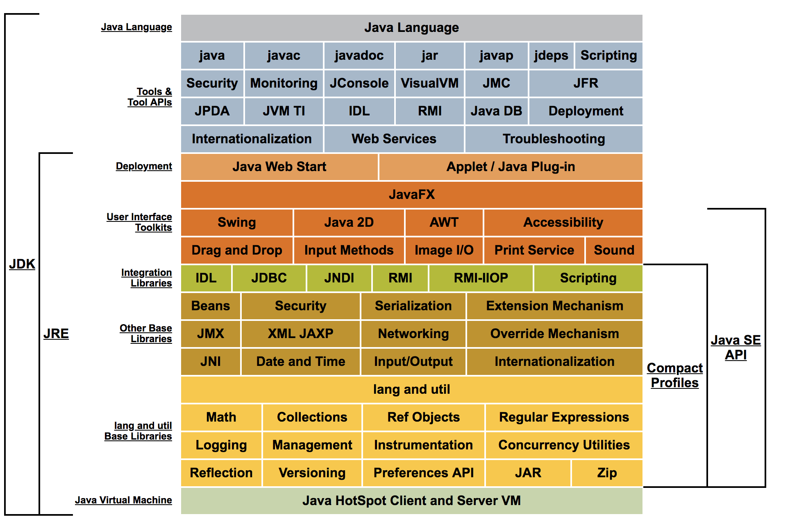

#   Java平台标准版8文档

Oracle有两个实现Java平台标准版（Java SE）8：Java SE开发工具包（JDK）8和Java SE运行时环境（JRE）8的产品。

JDK 8是JRE 8的超集，包含JRE 8中的所有内容，以及用于开发小应用程序和应用程序所需的编译器和调试器等工具。JRE 8提供库，Java虚拟机（JVM）和其他组件来运行用Java编程语言编写的小应用程序和应用程序。请注意，JRE包含Java SE规范不需要的组件，包括标准和非标准Java组件。

##  [Java™平台概述](technotes/guide.md)

以下概念图说明了Oracle的Java SE产品的组件：

##  [组件](SUMMARY.md)

