#   Java项目初始化

##  软件清单
|名称|版本|描述|下载|备注|
|----|----|----|----|----|
|JDK|1.8|Java平台环境|[地址](http://www.oracle.com/technetwork/java/javase/downloads/jdk8-downloads-2133151.html)|选择OS对应版本|
|OS|win/mac/ubuntu|操作系统|-|三种系统只是在环境配置上不同|
|IDE|STS|开发工具|[地址](https://spring.io/tools/sts/)|Eclipse上集成Spring，选择最新版，考虑[IDEA](https://www.jetbrains.com/idea/)|
|Maven|最新版|依赖包管理|[地址](https://maven.apache.org/)|第三方包管理，部署打包|
|Tomcat|Servlet兼容版|Java Web运行环境|[地址](http://tomcat.apache.org/)|Java Servlet规范实现|
----

##  软件配置

###  JDK
-   win
    -   与普通软件安装一样，注意选择路径
    -   环境变量配置："此电脑/计算机"-->属性(右键)
    -   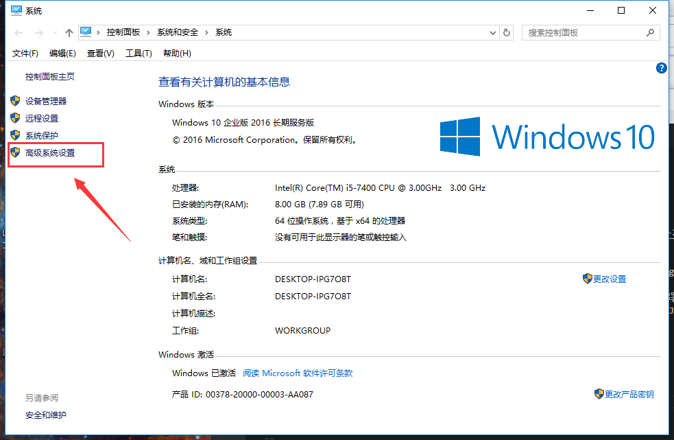
    -   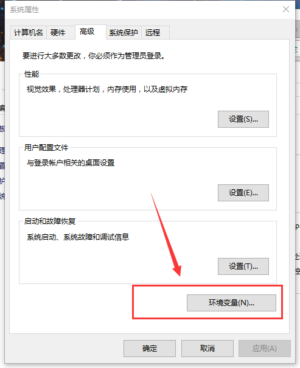
    -   系统变量--新建，上面是名，下面是值
    -   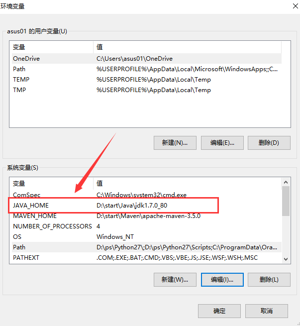
    -   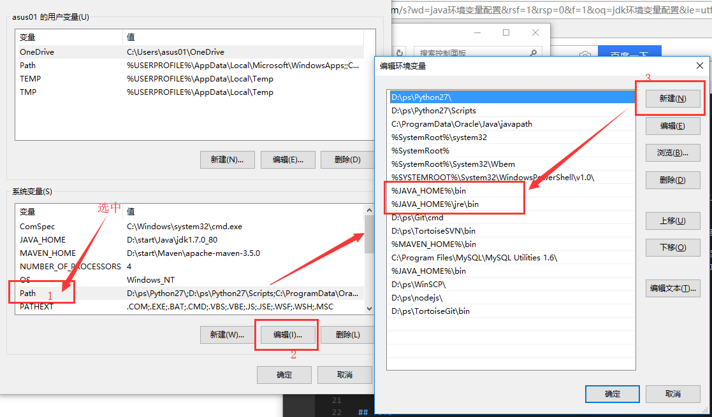
    ```
    JAVA_HOME=D:\start\Java\jdk1.7.0_80 // 安装的路径
    %JAVA_HOME%\bin
    %JAVA_HOME%\jre\bin
    ```
-   mac
    -   直接安装
-   ubuntu
    -   删除自带JDK
    ```
    sudo dpkg --list | grep -i jdk
    sudo apt-get purge openjdk*
-   Cent OS
    -   删除自带JDK
    ```
    su root
    rpm -qa | grep java
    yum remove java-xx-opxx-hexx
    // 然后再看看
    ```
-   配置
    ```
    -   解压放在某路径下
    -   环境变量配置
    ```
        sudo gedit /etc/profile
        // 输入
        #set java environment
        JAVA_HOME=/opt/orcale/jdk1.8    // 放置的路径
        export JRE_HOME=/opt/orcale/jdk1.8/jre
        export CLASSPATH=.:$JAVA_HOME/lib:$JRE_HOME/lib:$CLASSPATH
        export PATH=$JAVA_HOME/bin:$JRE_HOME/bin:$PATH
    ```
-   验证
    -   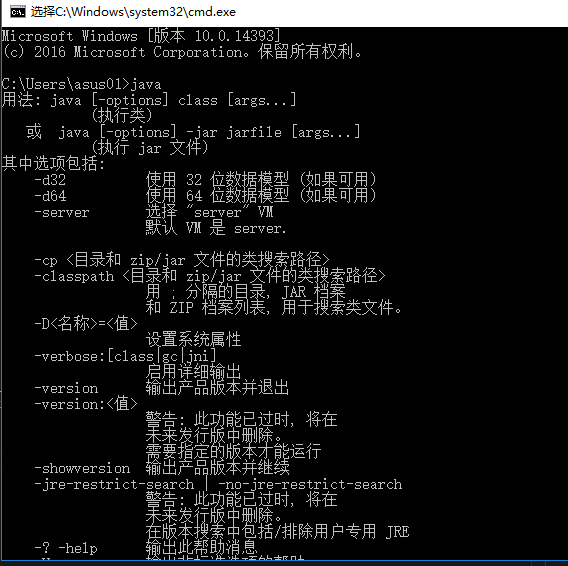
    ```
    java
    ```

###  STS
-   解压放在某路径下，免安装，直接运行

###  Maven
-   解压放在某路径下
-   win
    -   环境变量配置
    -   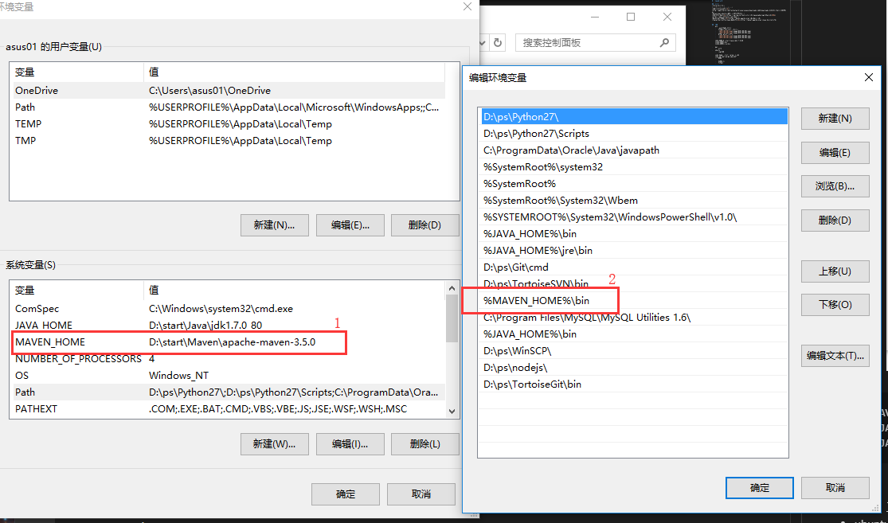
-   ubuntu
    -   环境变量配置
    ```
    sudo gedit /etc/profile
    // 输入
    M2_HOME=/opt/apache/apache-maven-3 // 放置的路径
    export MAVEN_OPTS="-Xms256m -Xmx512m"
    export PATH=$M2_HOME/bin:$PATH
    ```
-   验证
    -   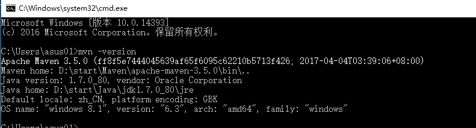
    ```
    mvn -version
    ```
-   镜像
    -   打开`apache-maven-3.3.9\conf`目录，编辑`settings.xml`
    ```
    // 设置jar包路径
    修改：<localRepository>/opt/apache/maven</localRepository>

    // 中央仓库
    <mirrors>
        <mirror>
            <id>alimaven</id>
            <name>aliyun maven</name>
            <url>https://maven.aliyun.com/repository/public</url>
            <mirrorOf>central</mirrorOf>
        </mirror>
    </mirrors>
    ```

###  Tomcat
-   解压放在某路径下

##  新建项目
-   操作系统在这部分是相同的

### STS/Eclipse配置
-   Window --> Preferences
-   设置编码
    -   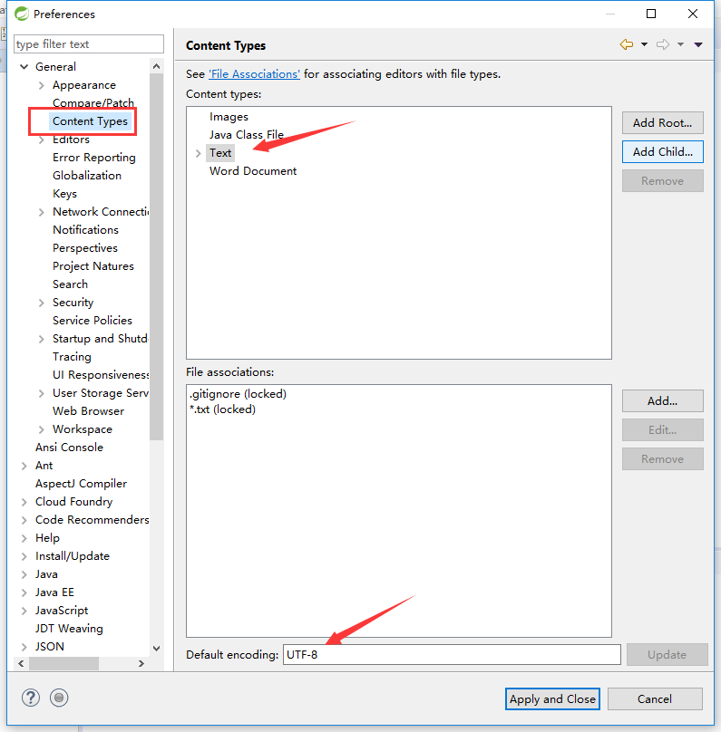
    -   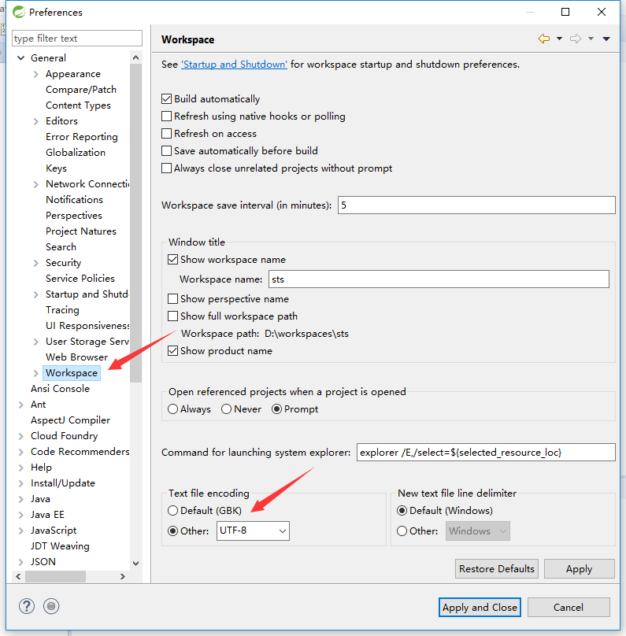
-   设置JDK编译版本
    -   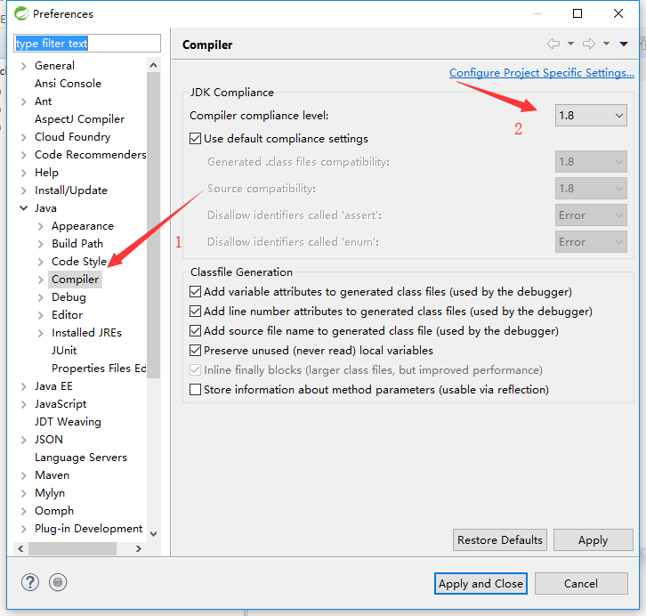
-   设置JDK，选择安装位置
    -   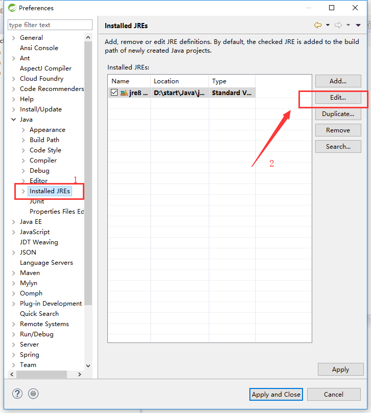
    -   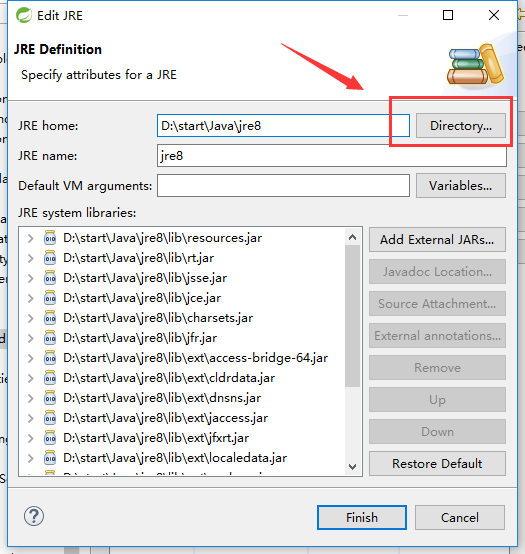
-   设置Maven
    -   
    -   `3`选择安装位置 
    -   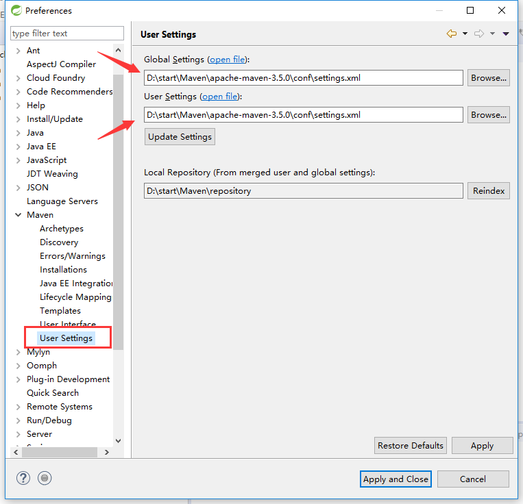
-   设置Tomcat
    -   


----

##  项目示例

### 新建项目
-   Java SE
    -   File --> New --> Maven Project
    -   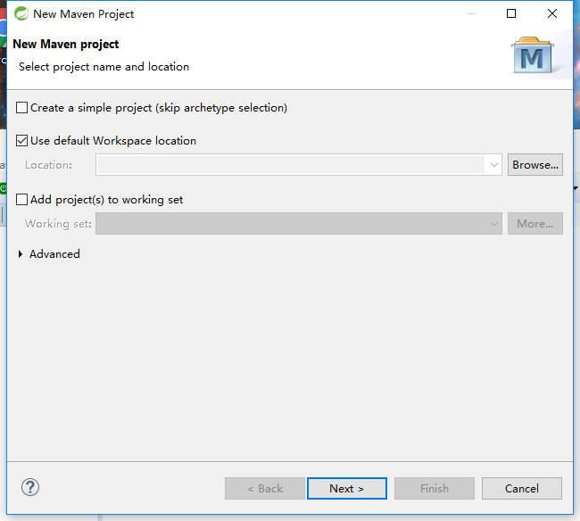
    -   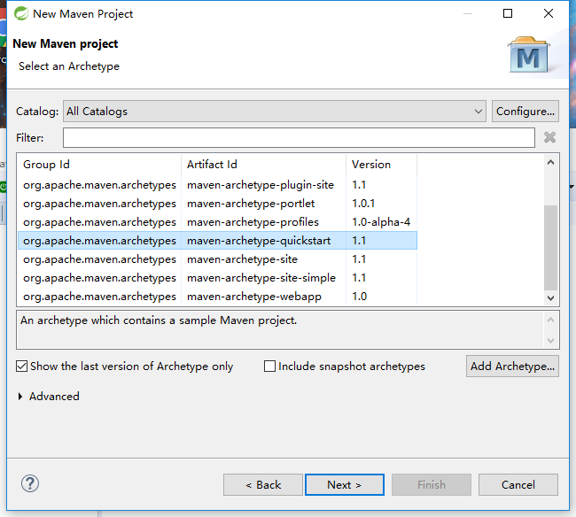
    -   
-   Java EE
    -   第一步与第三步相同
    -   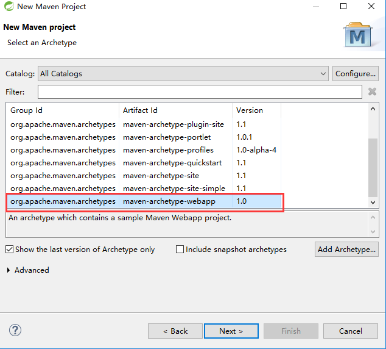
-   设置jdk项目环境
    -   点击项目 -- > Build Path -- > Configure Build Path
    -   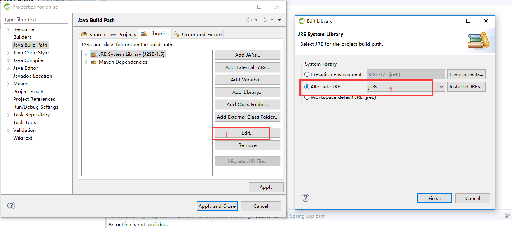
-   设置tomcat
    -   
    -   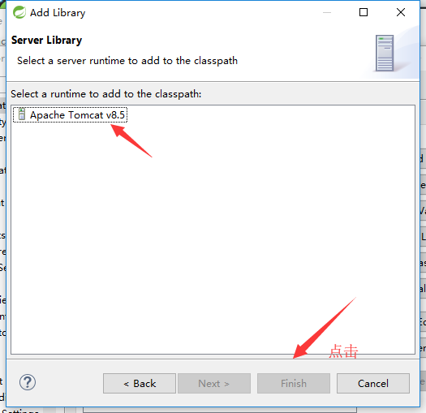
    -   

### 项目模板
-   [简单：en-se](https://github.com/kaoshanji/example)


----

##  备注
-   IDEA
    -   使用 2017.1/2版本，注册码好找，[地址](https://confluence.jetbrains.com/display/IDEADEV/IDEA+2017.1+EAP)
    -   win 系统下需要设置[编码](https://blog.csdn.net/m0_38132361/article/details/80628203)

