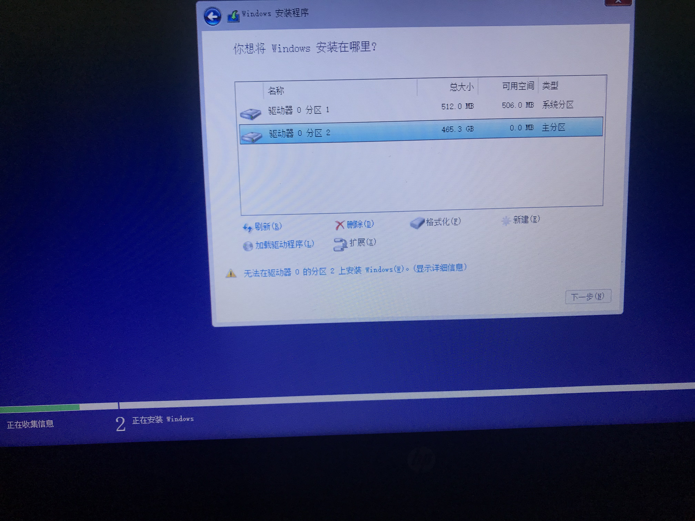
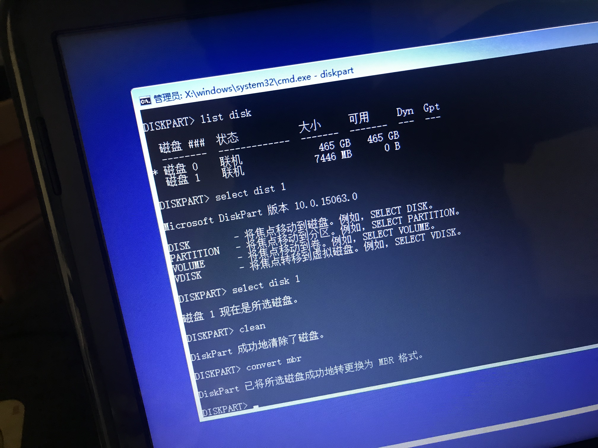

#   操作系统

##  win
-   windows10企业版2016长期服务版的官方名称叫Windows 10企业LTSB版，根据微软支持生命周期页面显示Win10的扩展支持周期延长1年时间。它与其他版本相比，无Edge浏览器、小娜，无磁铁，可选是否下载和安装补丁，其它版都不能自选补丁，适合办公
-   ```
    win10 2016 长期服务版的ISO文件中本身就带有KMS激活KEY，不用输入任何KEY，连接网络，以管理员身份进入CMD，只要一一输入：
    slmgr /skms kms.digiboy.ir
    slmgr /ato
    这两条命令，就可以KMS激活。
    ```
-   系统不能识别磁盘格式
    -   
    -   在当前安装界面按住Shift+F10调出命令提示符窗口
    -   输入diskpart，按回车执行
    -   
-   [U盘制作](https://www.microsoft.com/zh-cn/software-download/windows10)    


##  Linux
-   U盘安装CentOS 系统需要使用USBWriter软件
-   U盘安装ubuntu 系统用ultraiso


##  U盘
-   U盘可以识别但是不能打开也不能格式化而且空间也变小了，`解决`：老毛桃 "初始化U盘"

