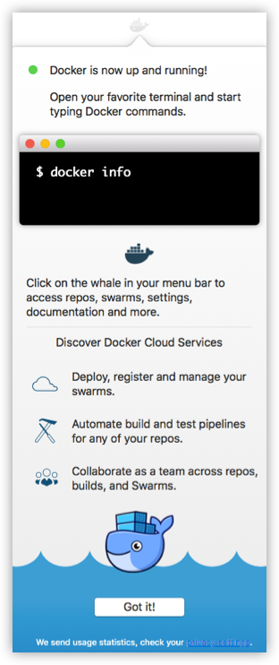

#  MAC里安装

`Docker for Mac`是一款`Docker Community Edition（CE）`应用程序。`Docker for Mac`安装包包括在Mac上运行Docker所需的一切。本主题介绍安装前的注意事项，以及如何下载和安装`Docker for Mac` 

##  下载Docker for Mac
-   [稳定版](https://download.docker.com/mac/stable/Docker.dmg)
    -   校验码：Docker.dmg SHA256
-   [最新版](https://download.docker.com/mac/edge/Docker.dmg)
    -   校验码：Docker.dmg SHA256
-   适用于Mac的Docker需要OS X El Capitan 10.11或更新的MacOS版本，该版本运行于2010或更新版本的Mac上，并配备英特尔对MMU虚拟化的硬件支持

##  系统要求
>   只有满足所有这些要求，Docker for Mac才会启动
-   Mac必须是2010或更新的型号，英特尔的硬件支持内存管理单元（MMU）虚拟化; 即扩展页表（EPT）和无限制模式
-   支持OS X El Capitan 10.11和更新的macOS版本。至少，Docker for Mac需要macOS优胜美地10.10.3或更新版本
-   至少4GB的RAM
-   不得安装4.3.3之前的VirtualBox（与Docker for Mac不兼容）
-   `注意`：如果您的系统不能满足这些要求，您可以安装Docker Toolbox，它使用Oracle VirtualBox而不是HyperKit

##  安装包括
>   安装提供了 Docker Engine，Docker CLI客户端， Docker Compose，Docker Machine和Kitematic

##  安装并运行Mac的Docker
1.  双击`Docker.dmg`打开安装程序，然后将Docker拖动到`Applications`文件夹

2.  双击Docker.app应用程序文件夹以启动Docker。（在下面的例子中，Applications文件夹处于“网格”视图模式。）

`Docker.app`启动后，系统会要求您使用系统密码进行授权。需要特权访问才能安装连接到Docker应用程序的网络组件和链接

顶部状态栏中的鲸鱼表示Docker正在运行，并可从终端访问

如果您刚刚安装了该应用程序，则还会收到一条成功消息，并提供建议的后续步骤以及此文档的链接。点击菜单状态栏中的鲸鱼（）来关闭这个弹出窗口

3.  点击鲸鱼获得首选项和其他选项

4.  选择`关于Docker`来验证您是否拥有最新版本

