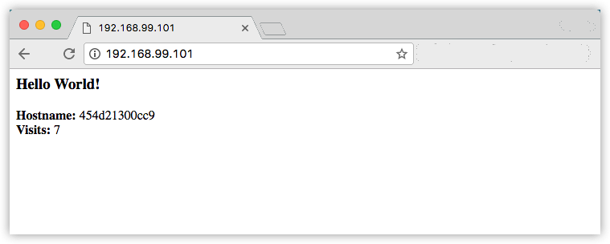

#   入门，第 5 部分：技术栈

##  先决条件
-   安装 Docker 版本 1.13 或更高版本
-   按照第 3 部分：先决条件中所述，获取 Docker Compose
-   按照第 4 部分：先决条件中所述，获取 Docker Machine
-   阅读第 1 部分中的新用户导引
-   在第 2 部分中了解如何创建容器
-   确保您已发布通过将其推送到镜像库创建的 `friendlyhello` 镜像。我们将在此处使用该共享镜像
-   确保您的镜像充当已部署的容器。运行以下命令，并填写 `username`、`repo` 和 `tag` 信息：`docker run -p 80:80 username/repo:tag`，然后访问 `http://localhost/`
-   就近从第 3 部分获取 `docker-compose.yml` 的副本
-   确保您在第 4 部分中设置的机器处于运行状态并且已准备就绪。运行 `docker-machine ls` 对此进行验证。如果机器已停止，请运行 `docker-machine start myvm1` 启动管理节点，然后运行 `docker-machine start myvm2` 启动工作节点
-   运行您在第 4 部分中创建的 swarm 并使其做好准备。运行 `docker-machine ssh myvm1 "docker node ls"` 对此进行验证。如果 swarm 已启动，这两个节点都将报告 `ready` 状态。如果未启动，请按照`设置 swarm` 中的说明重新初始化 `swarm` 并加入工作节点

##  简介

在第 4 部分中，您已学习如何设置 swarm（运行 Docker 的机器的集群），并向其部署了应用，容器一起运行在多台机器上

在第 5 部分中，您将在此处了解分布式应用的层次结构的最高级别：`技术栈`。技术栈是一组相关的服务，它们共享依赖项并且可以一起进行编排和扩展。单个技术栈能够定义和协调整个应用的功能（虽然很复杂的应用程序可能需要使用多个技术栈）

好消息是，从第 3 部分开始，在创建 Compose 文件并使用 `docker stack deploy` 时，您一直在技术层面使用技术栈。但是，这是在单个主机上运行的单服务技术栈，通常不是生产中出现的内容。您将在此处使用已学习的知识，使多项服务彼此关联并在多台机器上运行这些服务

您做得很好，这是工作的最后部分

##  添加新服务和重新部署

向 `docker-compose.yml` 文件中添加服务非常容易。首先，添加一项免费的可视化程序服务，我们可以通过此服务了解 swarm 如何调度容器

1.  在编辑器中打开 `docker-compose.yml` 并将其内容替换为以下内容。确保将 `username/repo:tag` 替换为镜像详细信息
```
version:"3"
 services:
   web:
     # 将 username/repo:tag 替换为您的名称和镜像详细信息
     image: username/repo:tag
     deploy:
       replicas:5
       restart_policy:
         condition: on-failure
       resources:
         limits:
           cpus:"0.1"
           memory:50M
     ports:
       - "80:80"
     networks:
       - webnet
   visualizer:
     image: dockersamples/visualizer:stable
     ports:
       - "8080:8080"
     volumes:
       - "/var/run/docker.sock:/var/run/docker.sock"
     deploy:
       placement:
         constraints:[node.role == manager]
     networks:
       - webnet
 networks:
   webnet:
```

此处唯一的新内容是 `web` 的对等服务 `visualizer`。您将在此处看到两项新内容：`volumes` 键（使可视化程序能够访问 Docker 的主机套接字文件）和 `placement` 键（用于确保此服务仅在 swarm 管理节点上运行，而从不在工作节点上运行）。这是因为根据 Docker 所创建的开源项目构建的此容器在图中显示了 `swarm` 上运行的 Docker 服务

我们一会儿会讨论有关布局约束和存储卷的更多内容

2.  请将此新的 `docker-compose.yml` 文件复制到 swarm 管理节点 `myvm1`：
```
docker-machine scp docker-compose.yml myvm1:~
```

3.  在管理节点上重新运行 `docker stack deploy` 命令，并且将更新需要更新的所有服务：
```
$ docker-machine ssh myvm1 "docker stack deploy -c docker-compose.yml getstartedlab"
 Updating service getstartedlab_web (id: angi1bf5e4to03qu9f93trnxm)
 Updating service getstartedlab_visualizer (id: l9mnwkeq2jiononb5ihz9u7a4)
```

4.  查看可视化程序

您可以在 Compose 文件中看到 `visualizer` 在端口 8080 上运行。通过运行 `docker-machine ls` 获取其中一个节点的 IP 地址。转至 IP 地址（端口 8080），您将看到可视化程序正在运行：


`visualizer` 的单个副本正按您的预期在管理节点上运行，并且 web 的五个实例已在 swarm 中展开。您可以运行 `docker stack ps <stack>` 来证实此内容：
```
docker-machine ssh myvm1 "docker stack ps getstartedlab"
```

可视化程序是一项独立服务，它可以在技术栈中的任何应用（包括它自己）中运行。它不依赖于任何其他内容。现在，我们创建具有依赖项的服务：将提供访客计数器的 Redis 服务。

##  留存数据

重新运行一遍同一工作流，以添加用于存储应用数据的 Redis 数据库

1.  保存这个新的 `docker-compose.yml` 文件，它最终会添加 Redis 服务。确保将 username/repo:tag 替换为镜像详细信息
```
version:"3"
 services:
   web:
     # 将 username/repo:tag 替换为您的名称和镜像详细信息
     image: username/repo:tag
     deploy:
       replicas:5
       restart_policy:
         condition: on-failure
       resources:
         limits:
           cpus:"0.1"
           memory:50M
     ports:
       - "80:80"
     networks:
       - webnet
   visualizer:
     image: dockersamples/visualizer:stable
     ports:
       - "8080:8080"
     volumes:
       - "/var/run/docker.sock:/var/run/docker.sock"
     deploy:
       placement:
         constraints:[node.role == manager]
     networks:
       - webnet
   redis:
     image: redis
     ports:
       - "6379:6379"
     volumes:
       - ./data:/data
     deploy:
       placement:
         constraints:[node.role == manager]
     networks:
       - webnet
 networks:
   webnet:
```

Redis 具有 Docker 库中的官方镜像，并且为其指定了短 `image` 名称 `redis`，因此此处没有 `username/repo` 表示法。Redis 已将 Redis 端口 6379 预先配置为从容器开放给主机，并且在此处的 Compose 文件中，我们会将其从主机开放给整个环境，因此您实际上可以将任何节点的 IP 输入 Redis Desktop 管理节点中并管理此 Redis 实例（如果您选择执行此操作）。

最重要的是，`redis` 规范中的一些内容可以在此技术栈的部署之间持久存储数据：
-   `redis` 始终在管理节点上运行，因此它始终使用同一文件系统
-   `redis` 将访问主机文件系统中的任意目录，作为容器内的 `/data`，这是 Redis 存储数据的位置

这将在您的主机物理文件系统中为 Redis 数据创建一个“可信来源”。如果没有此项，Redis 会将其数据存储在容器的文件系统内的 `/data` 中，在重新部署了容器的情况下这些数据将被擦除。

此可信来源包含两个部分：
-   您对 Redis 服务设置的布局约束，用于确保它始终使用同一主机
-   您创建的存储卷，可以使容器访问 `./data`（位于主机上）作为 `/data`（位于 Redis 容器内）。虽然容器经常变换，但存储在指定主机上的 `./data` 中的文件仍持续存在，从而实现了连续性

您已准备好部署新的使用 Redis 的技术栈

2.  在管理节点上创建 ./data 目录
```
$ docker-machine ssh myvm1 "mkdir ./data"
```

3.  使用 docker-machine scp 复制新的 docker-compose.yml 文件：
```
$ docker-machine scp docker-compose.yml myvm1:~
```

4.  再次运行 `docker stack deploy`
```
$ docker-machine ssh myvm1 "docker stack deploy -c docker-compose.yml getstartedlab"
```

5.  检查其中一个节点（例如，`http://192.168.99.101`）上的网页，您将看到访客计数器的结果，它现在处于活动状态并存储有关 Redis 的信息



另外，检查节点 IP 地址上的可视化程序（端口 8080），然后您将看到 `redis` 服务正在与 `web` 和 `visualizer` 服务一起运行


