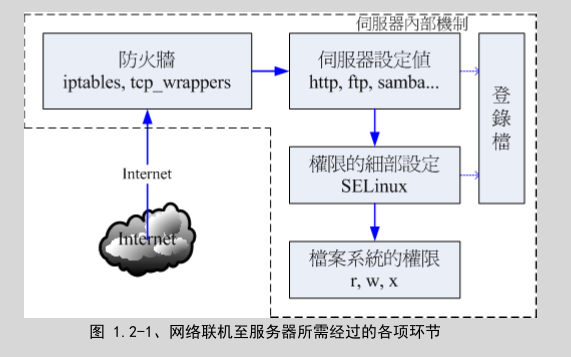

##  基本架设服务器流程：架站容易维护难
-   基本功课
    -   基础网络的基本概念，以方便进行联网与设定及除错
    -   熟悉操作系统的简易操作：包括登录分析、账号管理、文书编辑器的使用等等的技巧
    -   信息安全方面：包括防火墙与软件更新方面的相关知识等等
    -   该服务器协议所需软件的基本安装、设定、除错等
-   基本架设服务器流程
    -   
    -   将整个登录分为几个部分，包括：网络、服务器本身、内部防火墙软件设定、各项服务配置文件、细部权限的 SELinux 以及最终最重要的档案权限
    -   网络：了解网络基础知识与所需服务之通讯协议
        -   基本的网络基础知识：包括以太网络硬件与协议、TCP/IP、网络联机所需参数等
        -   各网络服务所对应的通讯协议原理，以及各通讯协议所需对应的软件
    -   服务器本身：了解架网络服务器之目的以配合主机的安装规划
        -   那...架什么服务器？
        -   这个服务器要不要对 Internet 开放？
        -   这个服务要不要针对客户提供相关账号？ 
        -   要不要针对不同的客户账号进行例如磁盘容量、可活动空间与可用系统资源进行限制？
    -   服务器本身：了解操作系统的基本操作
        -   包括软件如何安装与移除？ 
        -   如何让系统进行例行的工作管理？
        -   如何依据服务器服务之目的规划文件系统？
        -   系统如何管理各项服务之启动？
        -  系统的开机流程为何？
        -  系统出错时，该如何进行快速复原
    -   内部防火墙设定：管理系统的可分享资源
        -   透过防火墙来规范可以使用本服务器服务的用户，以让系统在使用上拥有较佳的控管情况
    -   服务器软件设定：学习设定技巧与开机是否自动执行
        -   所需要的服务是由哪个软件达成的？
        -   同一个服务可否有不同的软件？
        -   每种软件可以达成的目的是否相同？ 
        -   依据所需要的功能如何设定你的服务器软件？
        -   架设过程中如果出现错误，你该如何观察与除错？
        -   软件如何安装、如何查询相关配置文件所在位置
        -   服务器软件如何设定？
        -   服务器软件如何启动？如何设定自动开机启动？如何观察启动的端口？
        -   透过客户端进行联机测试，如果失败该如何处理？
        -   联机失败的原因是服务器还是防火墙？
        -   服务器的设定修改是否有建立日志？登录档是否有定期分析？
        -   服务器所提供或分享的数据有无定期备份？
        -   如何定期自动备份或异地备份？
    -   细节权限设定：包括 SELinux 与档案权限
    -   系统安全与备份处理