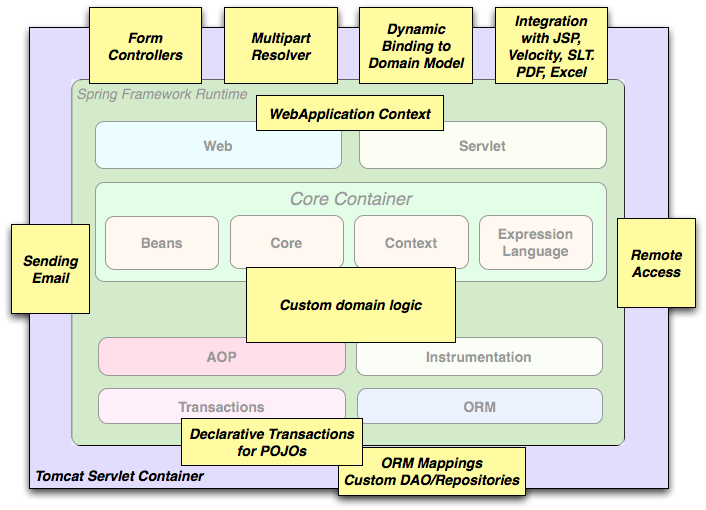

#   spring-framework

##  综述

Spring Framework是一个Java平台，为开发Java应用程序提供全面的基础架构支持。Spring处理基础架构，因此您可以专注于您的应用程序。

基于`原生类库`语法，`整合`特定功能，`隐藏`具体细节，直接`面向`应用。

Spring框架提供了全面的编程和配置模型为现代的基于Java的企业应用-在任何类型的部署平台。Spring侧重于企业应用程序的“管道”，以便团队可以专注于应用程序级别的业务逻辑，而不必与特定部署环境形成不必要的联系

Spring框架是一个轻量级的解决方案，并且是构建企业级应用程序的潜在一站式方案。然而，Spring是模块化的，只允许你使用那些你需要的部分，而不需要引入其他的部分。

Spring使您能够构建来自“普通Java对象”（POJO）的应用程序，并将企业服务以非侵入方式应用于POJO。此功能适用于Java SE编程模型和全部及部分Java EE。

Spring被设计成非侵入式的，这意味着你的域逻辑代码通常不依赖框架本身。

可以使用IoC容器，顶部有任何Web框架，但您也可以只使用 Hibernate集成代码或JDBC抽象层。Spring框架支持声明式事务管理，通过RMI或Web服务对您的逻辑进行远程访问，以及用于保存数据的各种选项。它提供了一个全功能的MVC框架，并使您能够将AOP透明地集成到您的软件中。作为应用程序开发人员，您可以从Spring平台中受益：
-   在数据库事务中执行Java方法而不必处理事务API。
-   使本地Java方法成为HTTP端点而不必处理Servlet API。
-   使本地Java方法成为消息处理程序，而不必处理JMS API。
-   使本地Java方法成为管理操作，而不必处理JMX API。

----

##  版本：4.3.9.RELEASE
-   [文档](https://docs.spring.io/spring/docs/4.3.9.RELEASE/spring-framework-reference/htmlsingle/)
-   [API](https://docs.spring.io/spring/docs/4.3.9.RELEASE/javadoc-api/)

----

##  模块结构

Spring框架由约20个模块组成的特征组成。这些模块分为核心容器，数据访问/集成，Web，AOP（面向方面​​编程），Instrumentation，Messaging和Test，如下图所示

----

##  功能应用
-   [核心技术](chapter01/README.md)
-   [测试](chapter02/README.md)
-   [数据访问](chapter03/README.md)
-   [Web框架](chapter04/README.md)
-   [集成](chapter05/README.md)

----

##  典型的全面的Spring Web应用程序

Spring的声明式事务管理功能使Web应用程序完全事务化，就像使用EJB容器管理的事务一样。所有的定制业务逻辑都可以用简单的POJO来实现，并由Spring的IoC容器来管理。其他服务包括支持发送独立于Web层的电子邮件和验证，以便您选择执行验证规则的位置。Spring的ORM支持与JPA，Hibernate和JDO集成; 例如，在使用Hibernate时，您可以继续使用现有的映射文件和标准的Hibernate `SessionFactory`配置。表单控制器可以将网络层与领域模型无缝集成，从而消除了需要`ActionForms` 或将HTTP参数转换为您的域模型的值的其他类。

----

##  动手实践
-   Hello

----

##  源码解析
-   源码编译

-----

##  Spring Framework Artifacts

|GroupId|ArtifactId|描述|
|----|----|----|
|org.springframework|spring-aop|基于代理的AOP支持|
|org.springframework|spring-aspects|基于AspectJ的方面|
|org.springframework|spring-beans|Bean支持，包括Groovy|
|org.springframework|spring-context|应用程序上下文运行时，包括调度和远程抽象|
|org.springframework|spring-context-support|支持将常见第三方库集成到Spring应用程序上下文中的类|
|org.springframework|spring-core|核心实用程序，被许多其他Spring模块使用|
|org.springframework|spring-expression|Spring表达语言（SpEL）|
|org.springframework|spring-instrument|Instrumentation agent for JVM bootstrapping|
|org.springframework|spring-instrument-tomcat|Tomcat的Instrumentation代理|
|org.springframework|spring-jdbc|JDBC支持包，包括DataSource设置和JDBC访问支持|
|org.springframework|spring-jms|JMS支持包，包括用于发送/接收JMS消息的帮助类|
|org.springframework|spring-messaging|支持消息传递体系结构和协议|
|org.springframework|spring-orm|对象/关系映射，包括JPA和Hibernate支持|
|org.springframework|spring-oxm|对象/XML映射|
|org.springframework|spring-test|支持单元测试和集成测试Spring组件|
|org.springframework|spring-tx|事务基础设施，包括DAO支持和JCA集成|
|org.springframework|spring-web|基础Web支持，包括Web客户端和基于Web的远程处理|
|org.springframework|spring-webmvc|Servlet堆栈的基于HTTP的模型 - 视图 - 控制器和REST端点|
|org.springframework|spring-webmvc-portlet|MVC实现将在Portlet环境中使用|
|org.springframework|spring-websocket|WebSocket和SockJS基础架构，包括STOMP消息传递支持|

-----