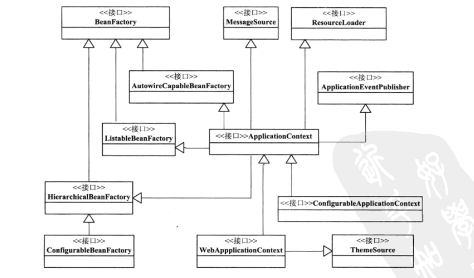
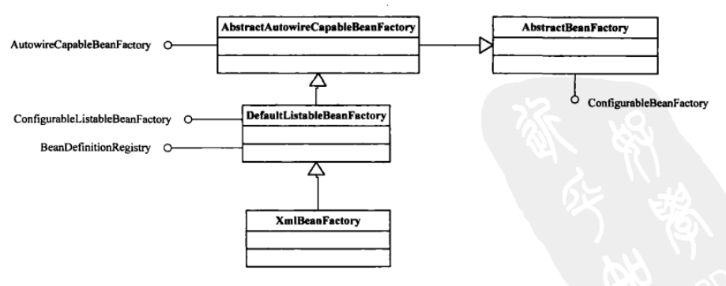

#   主要接口

在Spring IoC容器的设计中主要有两个容器系列，一个是实现`BeanFactory`接口的简单容器系列，这系列容器只实现了容器的最基本功能；另一个是`ApplicationContext`应用上下文，他作为容器的高级形态而存在。应用上下文在简单容器的基础上，增加了许多面向框架的特性，同事对应用环境做了许多适配

`BeanFactory`和`ApplicationContext`可以看成是容器的基本表现形式。通常所说的IoC容器，实际上代表着一系列功能各异的容器产品，只是容器的功能有大有小，有各自的特点

接口`BeanFactory`指定了基本的功能规范，体现了Spring为提供给用户使用的IoC容器所设定的最基本的功能规范，他是作为一个最基本的接口出现在Spring的IoC容器体系中

定义`BeanDefinition`接口用于Spring的应用中的各种对象以及他们之间的相互依赖关系，抽象我们对Bean的定义，是让容器起作用的主要数据类型

`ApplicationContext`在`BeanFactory`的基础上添加了附加功能：
-   支持不同的信息源。扩展了`MessageSource`接口，这些信息源的扩展功能可以支持国际化
-   访问资源。具体的`ApplicationContext`都是继承了`DefaultResourcesLoader`的子类
-   支持应用事件。继承了接口`ApplicationEventPublisher`，从而在上下文中引入了事件机制。这些事件和Bean的生命周期的结合为Bean的管理提供了便利

----

IoC容器的接口设计图

XmlBeanFactory设计的类继承关系

----

[DefaultListableBeanFactory全手动]()

`ApplicationContext`的子类大多都是具体的应用上下文，对应着不同的环境，主要功能在子类`AbstractXmlApplicationContext`里已经实现
[ClassPathXmlApplicationContext]()
-   对于这个实例化这个应用上下文的支持，同时启动IoC容器的`refresh()`过程
-   与`ClassPathXmlApplicationContext`设计具体相关的功能，这部分与增加从文件系统中加载XML的Bean定义资源有关

----