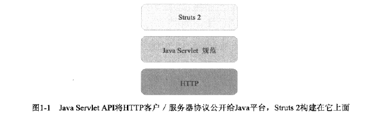

Struts2 doc

### 简介
- Struts2是MVC框架，帮助我们编写Web应用程序
- [官网](http://struts.apache.org/)
- [github-struts](https://github.com/apache/struts)
- [struts-examples](https://github.com/apache/struts-examples)

### 适用场景
- 复杂的Web应用。
- 当需要建立一个由复杂的业务逻辑和众多页面构成的Web应用时，需要采用分层开发模式，即：表示层、业务逻辑层和持久层。Struts2就是作为表示层的解决方案，帮助我们进行与表示层相关的开发工作。
- Web开发里日常任务：
    - 请求参数到Jav类型的数据绑定
    - 验证数据
    - 访问业务逻辑
    - 访问数据层
    - 呈现表示层
    - 配置映射
### 图解
- 理论基础
- 
    - HTTP 
        - 大多数的Web应用程序运行在HTTP之上，这个协议是一系列无状态的客户/服务器消息交换。客户通过向服务器发送一个对特定资源的请求而发起通信。HTTP是为请求和处理静态的HTML文档而设计的，所有基于HTTP的Web应用程序必须处理这个差异。
        - 对于Web应用程序而言，需要跨越HTTP协议的两个障碍---无状态和基于文本
        - 无状态，不能识别一系列请求是来自同一个客户端
        - 基于文本，Java是强类型语言，这个转换有些纠结
    - Java Servlet API
        - Java Servlet API将HTTP公开给Java平台，意味着Java开发人员可以以面向对象的抽象方式编写HTTP 服务器代码
        - Servlet API中的核心对象是Servlet、请求和响应
        - Servlet是一个单例的Java对象，用作接收请求、处理响应
        - 请求对象封装了各种各样的请求细节，包括通过表单字段提交的请求参与，以及查询字符串参数
        - 响应对象包含了如响应首部、生成响应文本的数据流等一些关键项目
        - 添加了回话，解决HTTP无状态特性
- 概览
- 
    - 控制器--- FilterDispatcher
        - 请求处理过程中第一个被触发的组件，工作是将请求映射到动作
        - Web应用程序的一个基本任务是将请求路由到Web应用程序中需要执行的一系列动作
        - 控制器的角色是由Struts2的FilterDispatcher来扮演，是一个Servlet过滤器，他检查每一个传入请求，决定那个Struts2动作处理这个请求
    - 模型----动作
        - 模型是事务本身，应用程序的内部状态，由数据模型和业务逻辑共同组成
        - 一个动作将业务逻辑调用封装到一个单独的工作单元中
        - 动作是一个数据传输的场所
    - 视图----结果
        - 视图是MVC模式的呈现组件，结果向Web浏览器返回页面
        - 这个页面是用户界面，向用户呈现应用程序的状态
        - 将应用程序的状态转换为一个用户可以与之交互的可视化的表示
- 工作原理
- 
    - 动作被控制器调用之后实际发生的情况
    - 拦截器
        - 在动作前有一系列拦截器，每个动作都有一组拦截器与之相关联
        - 拦截器在动作执行之前、之后都被调用，并且需要指出的是他们在结果执行完毕后才触发
        - 拦截器允许常见的、横切的任务在简洁、可重用的组件中定义，从而能够和动作的代码分离
        - 例如：日志
    - ValueStack和OGNL
        - ValueStack是保管与请求处理相关的所有数据的一个存储区域
        - OGNL是一种访问存储在中央存储库中数据的工具，他是一个允许你引用或操作ValueStack中的数据的表达式语言
    - ActionContext
        - ActionContext包含所有数据，这些数据构成了动作执行的环境
        - 他包含ValueStack，也包含框架会使用的内部数据，例如请求对象、会话对象以及从Servlet API中得到的应用程序映射
        - 是作为ValueStack的ThreadLocal的存储场所
        - 使用ThreadLocal可以在相同线程执行中的任何地方访问ActionContext或ValueStack
### 组件
- 动作
    - 框架的核心和灵魂
    - 为给定请求封装需要做的实际工作
    - 在从请求到视图的框架自动数据传输中作为数据的携带者
    - 帮助框架决定那个结果应给呈现请求响应中返回的视图
- 拦截器
    - 在后台默默无闻的真正英雄
    - 完成框架大部分处理工作
    - 消除了动作组件中横切任务
    - 改变调用工作流
- OGNL和类型转换
    - 从基于字符串的HTTP向Java语言的不同数据类型移动和转换数据
    - 数据转移和类型转换实际上发生在请求处理周期的两端
    - OGNG(对象图导航语言)，帮助框架实现数据转移和类型转换
- 视图/标签
    - 呈现页面
- 结果
    - 原生支持多种不同类型
    - 默认结果类型是JSP
- 集成
    - Spring，提供依赖注入，结果对象相互协作
    - JPA，提供持久化，与数据库联系
- 验证
    - 在动作里保证数据合法性
- 插件
    - SiteMesh：网页界面外观、布局和导航框架
    - Tiles：让开发人员通过构建模板来简化Web应用程序用户界面开发的框架
    - JFreeChart：允许一个动作返回包含生成的图表和图形的页面
### 实践
- 提单提交
- 上传下载
- 添加工作流
- 自定义类型转换
- 呈现数据
- 添加Spring和Hibernate
- 自定义验证器
- Strut内部扩展点
- 编写浏览器插件
- 动态方法调用
- 防止表单重复提交
