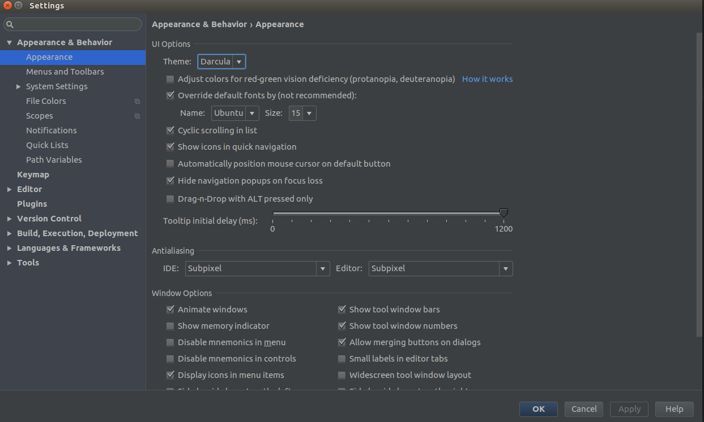
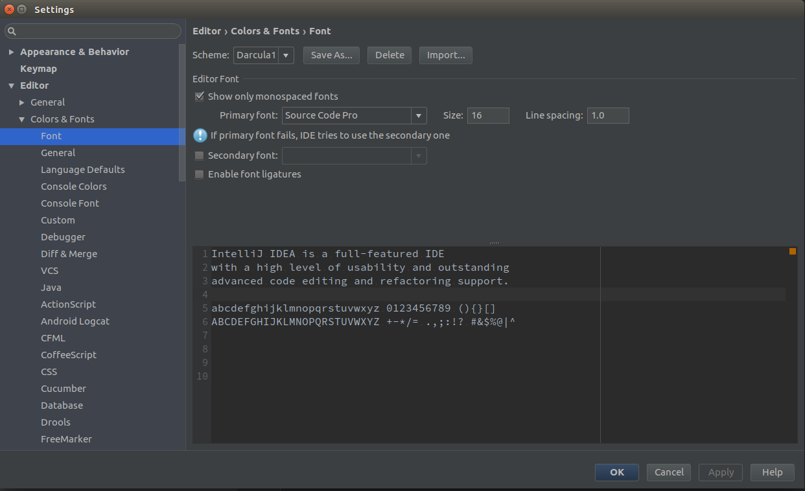
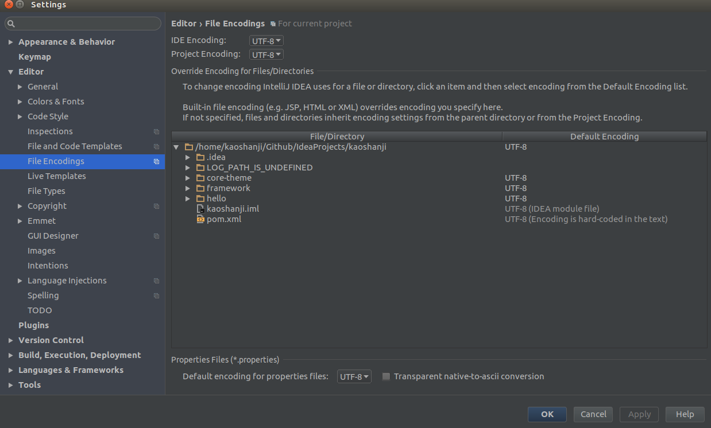
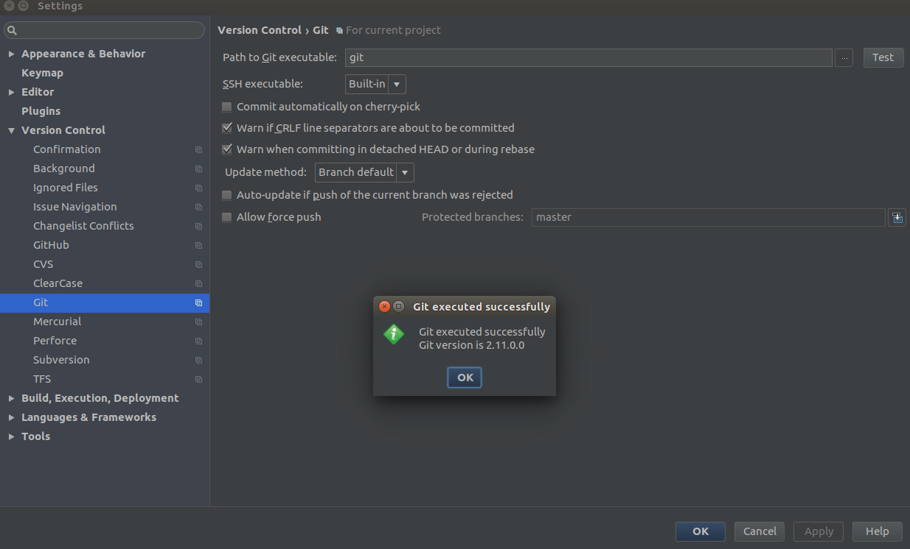
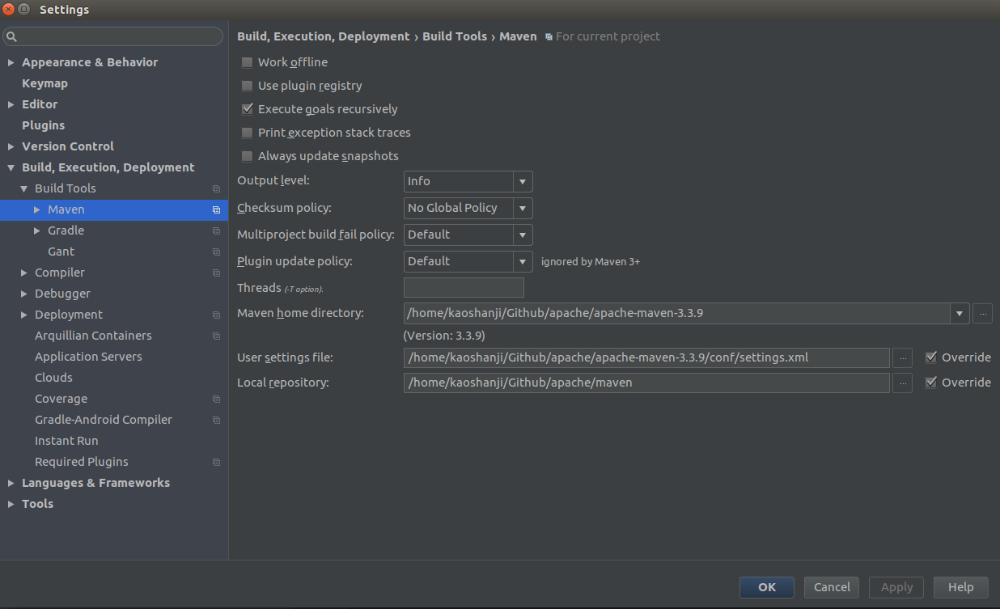
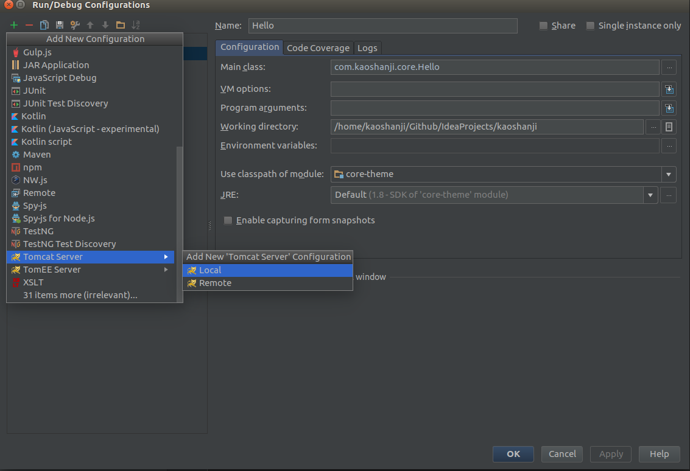
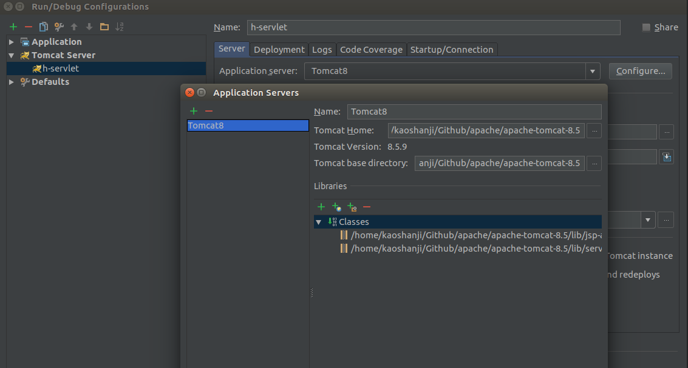
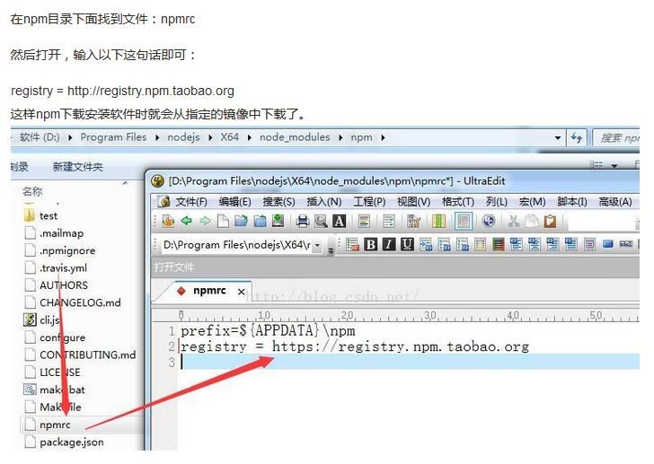

### ubuntu 开发环境

#### 软件系统及版本
> 统一一下系统软件环境

| 软件      | 版本号     | 备注    |
| --------- | --------- | ------- |
| OS        | ubuntu 17 |  win7   |
| Java SE   | 8         | -       |
| Java EE   | 7         | -       |
| Maven     | 3.3.3     | -       |
| Git       | 2.11      | -       |
| IDEA      | 2016.2.5  | -       |
| Tomcat    | 8.5       | -       |
| MySQL     | 5.6       | -       |

使用win系统还是很多，但是要尽量习惯Linux系统，在win下安装上述软件[百度](www.baidu.com)很容易获取，这里要说的是在ubuntu下，最终达到的效果一致，就不会有什么区别

1. 系统初始化
  - 更新
      `sudo apt update && sudo apt dist-upgrade`
      `// sudo update-manager -d`
  - 删除不用包
      `sudo apt autoremove --purge`
  - 清除某软件
      `sudo apt remove --purge xx*`
  - 加载依赖包
          sudo apt-get -f install
  - 杀死java进程
           ps -aux | grep java
           kill ...
  - 文件夹
           新建 sudo mkdir xx
           设置权限 sudo chmod -R 777 xx
  - 运行jar
            nohup java -jar xx-1.jar &
  - 演示uname
            这个命令可以查看系统信息，uname --help ，然后就好多选项，第一列是缩写、第二列是返回信息
  - 系统信息
            lsb_release
  - 查找Ng配置文件
            ps -ef | grep nginx
  - yum
            安装vsftpd：yum install vsftpd -y
  - 安装deb文件
            sudo dpkg -i xxx.deb
  - rpm
            检查是否安装vsftp：rpm -qa | grep vsftpd
2. 给安装文件找个地方
  - 软件安装在opt下，以组织新建文件夹，然后就是对应软件目录，例如：
            /opt
              /apache
                /apache-maven-3.3.9           //maven文件，需修改镜像和本地仓库
                /apache-tomcat-8.5.6          //tomcat，其实还不是很了解
                /maven                        //放置jar包
                /node-v4.4.4                  //node环境
              /docs                           //文档
                /glassfish4
                /Java-API-6
                /jdk-7u79-docs-all
                /jdk-8u102-docs-all
                /tomcat-8.5-doc
              /idea                          //IDE
                各种IDE的地方
              /orcale
                JDK。。。
3. 安装git
  - 安装git  
          sudo add-apt-repository ppa:git-core/ppa
          sudo apt-get update
          sudo apt-get install git
  - 设置本设备用户名
          git config --global user.name 'kaoshanji-X550JX'(使用用户名-设备名...当使用多台电脑时,这也算预留)
  - 设置邮箱
          git config --global user.email "github@xx.com"
  - 设置命令行
          git config --global color.ui auto
  - 查看用户名和邮件  
          git config user.name
          git config user.email
  - 设置密钥(命令提交时需要)
          ssh-keygen -t rsa 然后一路回车
          在GitHub 网站的"account settings"
          依次点击"Setting -> SSH Keys"->"New SSH key"
          Title处填写“id_rsa.pub”或其他任意信息。 key处原样拷贝下面命令的打印 `~/.ssh/id_rsa.pub` 文件的内容
          建议Title使用上面'设置本设备用户名',这样,比较好对应
  - 验证    
          输入 ssh -T git@github.com
          // 在上面填写的邮箱里会收到一封邮件
  - 几个命令常用命令,一般这就是全部了
    - 初始化
            某目录Github/Atom 下 git clone git@...
    - 添加到暂存区
            git add/rm (./加全部)
    - 提交至版本区
            git commit -m '说明'
    - 推送服务器
            git push
    - 拉取最新
            git pull
4. Java环境
  - JDK
    - 删除自带JDK
           sudo dpkg --list | grep -i jdk
           sudo apt-get purge openjdk*
            // 然后再看看
    - sudo gedit /etc/profile
            #set java environment
            JAVA_HOME=/opt/orcale/jdk1.8
            export JRE_HOME=/opt/orcale/jdk1.8/jre
            export CLASSPATH=.:$JAVA_HOME/lib:$JRE_HOME/lib:$CLASSPATH
            export PATH=$JAVA_HOME/bin:$JRE_HOME/bin:$PATH
  - 配置maven
            sudo gedit /etc/profile
            M2_HOME=/opt/apache/apache-maven-3
            export MAVEN_OPTS="-Xms256m -Xmx512m"
            export PATH=$M2_HOME/bin:$PATH
    - 打开apache-maven-3.3.9\conf目录，编辑settings.xml
      - 修改本地仓库位置
              修改：<localRepository>/opt/apache/maven</localRepository> 中间的路径为放置jar包路径
      - 修改镜像
              <mirrors>
                  <mirror>
                      <id>alimaven</id>
                      <name>aliyun maven</name>
                      <url>http://maven.aliyun.com/nexus/content/groups/public/</url>
                      <mirrorOf>central</mirrorOf>
                  </mirror>
              </mirrors>
              // 使用企业镜像
    - 当使用Maven模板创建项目无论选择什么archetype模型，加载都很慢时
      - 找到本地 maven项目 archetype 目录
      - 从 http://repo1.maven.org/maven2/archetype-catalog.xml下载的内容，本地生成一个archetype-catalog.xml 文件 放入archetype-catalog\2.4 目录下
      - 设置maven -> Runner/VM:Options 添加 -DarchetypeCatalog=local
      - 重新引入maven 刷新项目

5. IDEA
  - 快捷图标放在启动栏上
    - 打开命令界面
      - sudo gedit /usr/share/applications/android_studio.desktop
    - 输入
            [Desktop Entry]
            Type=Application
            Name=Android Studio
            Exec="/opt/android-studio/bin/studio.sh" %f
            Icon=/opt/android-studio/bin/studio.png
            Categories=development;IDE;
            Terminal=false
            StartupNotify=true
            StartupWMClass=jetbrains-android-studio
            // 替换里面的Exec和Icon路径
    - 保存文件，运行
      - sudo chmod +x /usr/share/applications/android_studio.desktop
    - 运行
      - sudo nautilus /usr/share/applications
    - 拖
      - android_studio.desktop文件，把文件拖动到Launcher条上
  - 设置软件界面主题
    - 
  - 设置编辑界面主题
    - 
  - 设置文件编码
    - 
  - 配置Git
    - 
    - 自动识别，在win下需要制定安装位置
  - 配置Maven
    - 
  - 配置Tomcat
    - 打开配置界面
    - 
    - 命名Tomcat,指定安装路径
    - 
    - 配置web项目:点击右下角"Fix"，列出可以运行的Web项目

6. MySQL
  > https://my.oschina.net/zzq911013/blog/724036

7. Node
  - 安装：下载解压到指定目录，像Java那样配置就行
              sudo gedit /etc/profile
              #set Node
              export NODE_HOME=/opt/apache/node-v4.4.4
              export PATH=$NODE_HOME/bin:$PATH
  - 设置镜像
              打开命令界面
              查看配置：npm config list
              设置镜像：npm config set registry " https://registry.npm.taobao.org"
              再看看是不是多了点什么
  - win
    - 
