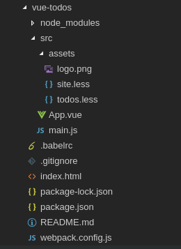
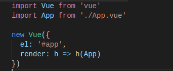
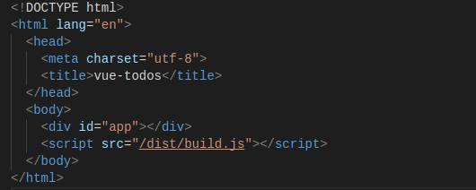

新建项目 doc

### 1.搭建环境
- 依赖Node.js环境，目前自带npm
1. Node.js
    - 让Js可以编写服务端
2. npm
    - 第三方插件/工具管理工具
    - 类似Java里 maven 库依赖管理

### 2.过程
1. 新建项目
- vue-cli
- 全局安装
    ```
    // 项目脚手架
    npm i vue-cli -g
    ```
- 建立项目
    - 工作空间下
    ```
    // 简单快捷的项目模板
    vue init webpack-simple vue-todos
    ```
    - `webpack-simple` 项目模板
    - `vue-todos` 项目名称
- 加载依赖初始化
    - 进入项目目录下
    - 命令界面有提示
        ```
        npm install
        ```
- 启动运行
    - 在项目目录下
    ```
    npm run dev
    ```
    - 默认浏览器就打开：`http://localhost:8080`
2. webpack-simple模板结构
- 
    - 开始时，没有`node_modules`目录，存放以来库
    - `src/assets`目录下，只有`logo.png`
- 说明
    - src
        - 源码
    - main.js
        - 
        - 程序入口，如同Java里`main`方法
        - 引入`vue`文件，并创建一个`Vue`对象实例
        - 将Vue实例绑定到一个页面上，完成初始化
        - Vue实例一般用作Vue的全局配置
            - 安装路由
            - 资源插件
            - 全局的自定义过滤器、自定义指令
    - index.html
        - 默认首页
        - 
        - Vue实例与页面`#app`的对应关系
    - App.vue
        - 默认Vue实例文件
        - *.vue是Vue.js特有的文件格式，表示一个Vue组件，称为单页式组件
        - 由`视图模板`、`样式定义`、`组件代码`组成
        - 分别对应三种标签
3. 项目模板
- package.json
- webpack.config.js
4. webpack模板
5. 文件组织
